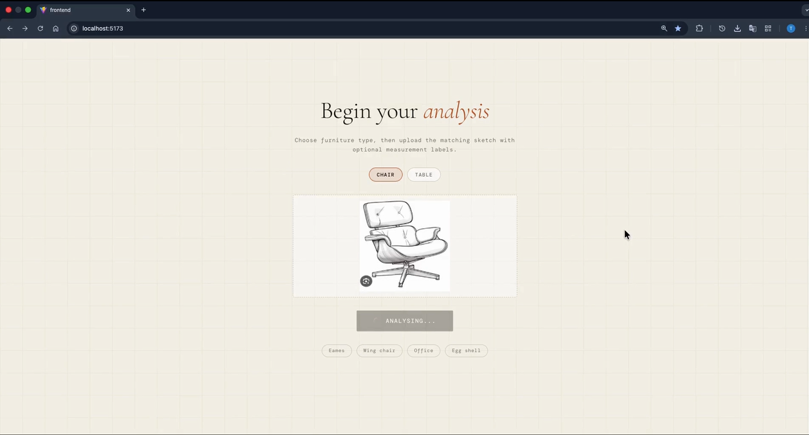
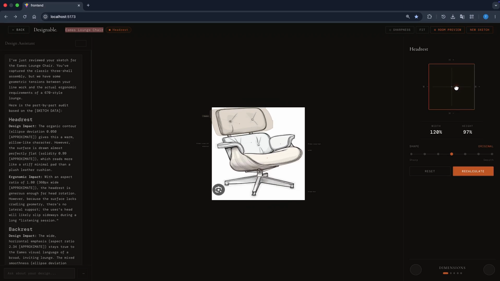
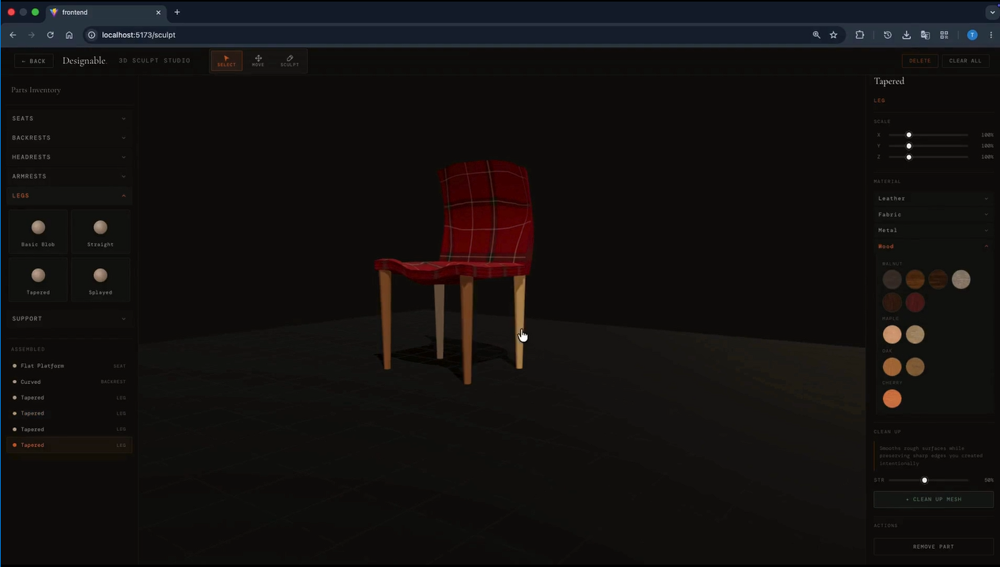

# DesignableAI

### AI-Powered Furniture Design, Analysis & 3D Sculpting

**DesignableAI** is an AI-powered furniture design platform that transforms hand-drawn furniture sketches into intelligent, editable digital designs.

The system combines **Computer Vision, OCR, geometric analysis, Generative AI, interactive 2D editing, material mapping, and browser-based 3D sculpting** into a single design workflow.

> **Final Year Project — FAST-NUCES | 2026**

---

## 📌 Overview

Furniture design often begins with a simple hand-drawn sketch containing individual components, proportions, dimensions, and design details.

Turning that sketch into a structured, editable digital design traditionally requires several disconnected tools and significant manual work.

**DesignableAI explores a different workflow.**

A user can upload a furniture sketch and the system can:

* Detect individual furniture components
* Extract handwritten measurements
* Analyze geometric properties
* Understand furniture structure
* Generate AI-assisted design insights
* Select and modify individual components
* Apply materials and textures
* Analyze ergonomic properties
* Enter a browser-based 3D sculpting environment
* Create and refine furniture geometry interactively

The complete workflow is:

**Sketch → Computer Vision → Geometry → AI Analysis → Interactive Editing → Materials → 3D Sculpting**

---

# ✨ Key Features

## 🖼️ AI-Powered Sketch Understanding

DesignableAI uses a custom-trained **YOLO segmentation model** to understand hand-drawn furniture sketches.

The model detects individual furniture components and generates polygon-level segmentation masks.

For example:

```text
                Furniture Sketch
                       │
                       ▼
              ┌─────────────────┐
              │  YOLO Segmentation │
              └────────┬────────┘
                       │
        ┌──────────────┼──────────────┐
        ▼              ▼              ▼
     Seat           Backrest        Armrest
        │              │              │
        └──────────────┼──────────────┘
                       ▼
                Structured Parts
```

This allows the system to treat different furniture components as independent objects rather than analyzing the sketch as a single image.

---

## 📐 Geometric Analysis

Once the furniture components are segmented, their geometry is analyzed to extract meaningful design information.

The analysis pipeline considers properties such as:

* Curvature
* Symmetry
* Edge regularity
* Relative proportions
* Component dimensions
* Positioning
* Shape characteristics

These geometric features are then used as structured information for downstream AI analysis.

---

## 🔍 OCR & Measurement Extraction

Furniture sketches frequently contain dimensions and handwritten annotations.

DesignableAI uses OCR to extract measurement information directly from the sketch.

This allows the system to combine:

**Visual geometry + extracted measurements + detected components**

into a more complete representation of the furniture design.

---

## 🤖 AI Design Intelligence

The extracted information is passed to **Google Gemini** for higher-level interpretation.

Instead of asking an AI model to analyze an image with little context, DesignableAI provides it with structured information derived from the actual sketch.

The AI can provide insights related to:

* Furniture classification
* Design characteristics
* Ergonomics
* Proportions
* Component relationships
* Design language
* Potential issues
* Design observations

The system also incorporates **confidence tagging** so that AI-generated observations can distinguish between stronger and weaker interpretations.

---

# ✏️ Interactive 2D Design Workspace

One of the core features of DesignableAI is the interactive workspace.

After the sketch has been processed, detected furniture parts can be individually selected and modified.

Users can:

* Select individual components
* Resize parts
* Modify dimensions
* Adjust component positioning
* See changes update directly on the canvas
* Recalculate relevant design and ergonomic properties

For example, changing the dimensions of a selected component can cause related parts to adjust automatically.

This transforms the original sketch from a static image into an **interactive design representation**.

---

# 🧵 Material Engine

DesignableAI includes a material engine that allows users to visualize different finishes on individual furniture components.

Available material categories include:

* 🪵 Wood
* 🧵 Fabric
* 🛋️ Leather
* 🔩 Metal

Materials can be selected and applied directly to individual components within the design.

This allows users to experiment with different visual combinations without manually editing the entire model.

---

# 🧊 3D Sculpt Studio

DesignableAI also includes a fully browser-based **3D Sculpt Studio**, built using **Three.js**.

No external 3D software is required.

The sculpting environment provides custom tools including:

| Tool           | Description                               |
| -------------- | ----------------------------------------- |
| **Grab**       | Locally move geometry                     |
| **Pinch**      | Pull geometry toward a selected region    |
| **Side Scale** | Scale geometry along a selected direction |
| **Smooth**     | Reduce unwanted surface irregularities    |
| **Flatten**    | Flatten a selected surface                |
| **Crease**     | Create sharper surface features           |

The sculpting system operates directly on **Three.js BufferGeometry**.

---

## ⚙️ 3D Sculpting Implementation

The sculpting tools were implemented around several core graphics techniques:

* Raycasting
* Vertex manipulation
* Gaussian falloff
* Local neighborhood calculations
* BufferGeometry operations
* Curvature-aware smoothing

### Curvature-Aware Smoothing

A variation of **Laplacian smoothing** was implemented to reduce rough surfaces while attempting to preserve intentional sharp features.

Rather than simply averaging neighboring vertices, the system takes local surface characteristics into consideration before applying smoothing.

This allows rough sculpted regions to be cleaned up without unnecessarily destroying important design details.

---

# 🔷 Procedural 3D Geometry

The 3D furniture presets are generated programmatically.

Instead of relying entirely on pre-made external model files, furniture geometry can be constructed directly through code.

This provides greater control over:

* Geometry generation
* Dimensions
* Component relationships
* Customization
* Runtime manipulation

---

# 🧠 System Architecture

The overall system can be viewed as the following pipeline:

```text
                         ┌──────────────────────┐
                         │   Hand-Drawn Sketch  │
                         └──────────┬───────────┘
                                    │
                                    ▼
                         ┌──────────────────────┐
                         │  Computer Vision     │
                         │  YOLO Segmentation   │
                         └──────────┬───────────┘
                                    │
                       ┌────────────┴────────────┐
                       │                         │
                       ▼                         ▼
              ┌────────────────┐        ┌────────────────┐
              │      OCR       │        │    Geometry    │
              │  Measurements  │        │    Analysis    │
              └───────┬────────┘        └───────┬────────┘
                      │                         │
                      └────────────┬────────────┘
                                   │
                                   ▼
                         ┌──────────────────────┐
                         │   Gemini AI Layer    │
                         │ Design Interpretation│
                         └──────────┬───────────┘
                                    │
                                    ▼
                         ┌──────────────────────┐
                         │ Interactive Workspace│
                         └──────────┬───────────┘
                                    │
                ┌───────────────────┼───────────────────┐
                │                   │                   │
                ▼                   ▼                   ▼
          2D Editing          Materials          3D Sculpting
                                                        │
                                                        ▼
                                                  Three.js/WebGL
```

---

# 🔄 End-to-End Workflow

A typical DesignableAI workflow looks like:

```text
1. Upload Furniture Sketch
            ↓
2. Detect Individual Components
            ↓
3. Extract Measurements with OCR
            ↓
4. Analyze Component Geometry
            ↓
5. Generate AI-Based Design Insights
            ↓
6. Select Individual Components
            ↓
7. Modify Dimensions / Proportions
            ↓
8. Apply Materials
            ↓
9. Enter 3D Sculpt Studio
            ↓
10. Sculpt and Refine Geometry
```

---

# 🛠️ Technology Stack

## Frontend

* React
* JavaScript / TypeScript
* Three.js
* HTML5 Canvas
* WebGL
* Interactive UI components

## Backend

* Python
* FastAPI
* REST APIs

## Computer Vision / Machine Learning

* YOLO
* Custom segmentation model
* Polygon-level instance segmentation
* OCR
* Image processing
* Geometric feature extraction

## Artificial Intelligence

* Google Gemini
* Vision-informed reasoning
* Furniture classification
* Design analysis
* Ergonomic analysis
* Confidence-aware responses

## 3D Graphics

* Three.js
* WebGL
* BufferGeometry
* Raycasting
* Procedural geometry
* Custom mesh manipulation

---

# 🧪 Computer Vision Pipeline

The computer vision system was trained specifically around furniture sketches.

### Pipeline

```text
                    Input Sketch
                         │
                         ▼
                Image Preprocessing
                         │
                         ▼
              YOLO Instance Segmentation
                         │
                         ▼
                  Polygon Masks
                         │
             ┌───────────┴───────────┐
             ▼                       ▼
        Component Data           OCR Data
             │                       │
             └───────────┬───────────┘
                         ▼
                  Geometry Analysis
                         │
                         ▼
                   Structured Data
                         │
                         ▼
                    Gemini AI
```

The resulting structured representation allows the rest of the application to reason about individual furniture components rather than treating the sketch as an unstructured image.

---

# 📊 Model Training

The segmentation model was trained using an annotated dataset of furniture sketches.

The training workflow consisted of:

1. Dataset collection
2. Data cleaning
3. Manual annotation
4. Dataset preprocessing
5. Train/validation splitting
6. YOLO segmentation training
7. Model evaluation
8. Inference testing
9. Integration into the application

The final model produces polygon-level segmentation masks for detected furniture components.

---

# 🎯 Engineering Challenges

Building DesignableAI involved several challenges beyond simply integrating existing APIs and libraries.

### Computer Vision

* Detecting components from imperfect hand-drawn sketches
* Handling irregular lines and ambiguous boundaries
* Producing useful polygon masks
* Converting masks into meaningful geometric information

### AI

* Grounding AI responses in information extracted from the actual sketch
* Combining visual information with structured geometry
* Handling uncertainty in AI-generated interpretations

### Interactive Design

* Keeping individual components independently editable
* Maintaining relationships between neighboring components
* Updating derived properties dynamically after modifications

### 3D Graphics

* Implementing sculpting operations from scratch
* Manipulating BufferGeometry in real time
* Creating localized vertex deformation
* Implementing Gaussian falloff
* Designing curvature-aware smoothing
* Preserving intentional sharp features

---

# 🎥 Demo & Screenshots

### Sketch Upload

```text

```

### Sketch Analysis done

```text

```

### 3D Sculpt Studio

```text

```

---

# 🌟 Project Highlights

* Custom-trained YOLO segmentation model
* Polygon-level furniture component detection
* OCR-based measurement extraction
* Automated geometric analysis
* Gemini-powered design intelligence
* Confidence-aware AI responses
* Interactive component-level editing
* Dynamic design and ergonomic analysis
* Material and texture engine
* Browser-based 3D sculpting
* Custom mesh manipulation algorithms
* Curvature-aware Laplacian smoothing
* Procedurally generated 3D furniture geometry
* Full-stack AI + Computer Vision + 3D integration

---

# 🔮 Future Improvements

Potential directions for future development include:

* Improved sketch-to-3D generation
* Expanded furniture categories
* Parametric furniture modeling
* Export to standard 3D formats
* More advanced ergonomic evaluation
* Improved material simulation
* AI-assisted design generation
* Manufacturing-aware design analysis
* Collaborative real-time editing
* Integration with professional CAD workflows

---

# 👥 Team

## Fahad Ahmad

**AI • Computer Vision • Full-Stack Development • 3D Systems**

## Taha

**AI • Computer Vision • Full-Stack Development • 3D Systems**

DesignableAI was developed collaboratively, with both team members contributing across the project's AI, computer vision, backend, frontend, and interactive 3D systems.

---

# ❤️ Acknowledgement

DesignableAI was developed as a Final Year Project at **FAST-NUCES**.

The project represents months of experimentation, engineering, debugging, iteration, and collaboration across multiple technical domains.

Special appreciation goes to everyone who supported, reviewed, tested, and provided feedback throughout the development process.

---

# 🎓 Academic Information

**Project:** DesignableAI
**Type:** Final Year Project
**Institution:** FAST-NUCES
**Year:** 2026
**Domains:** Artificial Intelligence • Computer Vision • Machine Learning • 3D Graphics • Full-Stack Development

---

# 📄 License

This project was developed as an academic Final Year Project.

Unless otherwise specified, the source code, trained models, assets, and project materials should not be redistributed or used commercially without permission from the authors.
